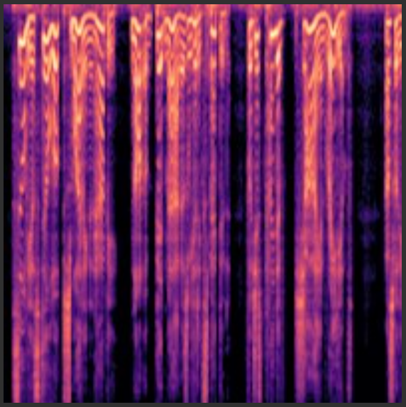
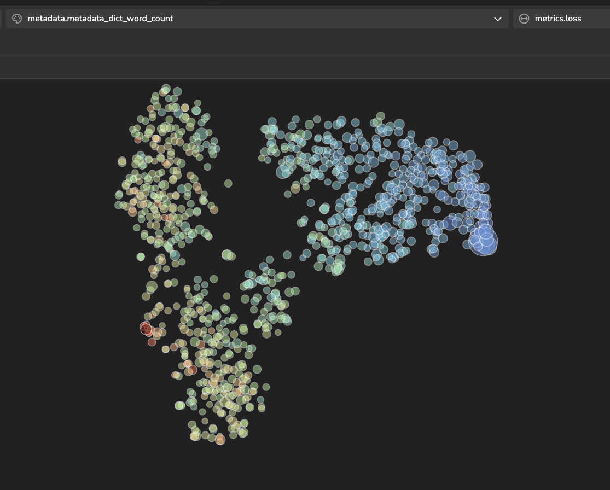
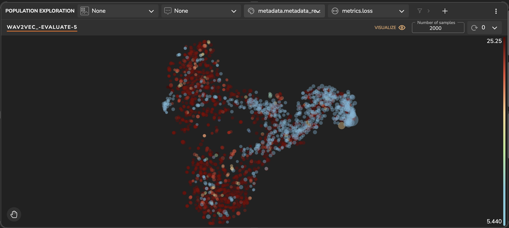
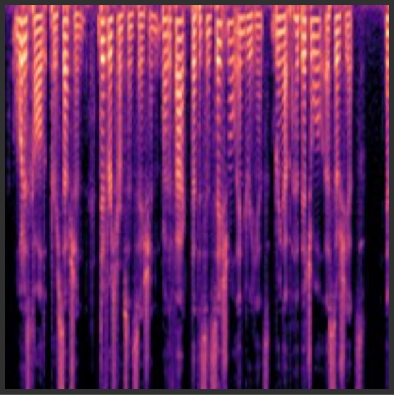
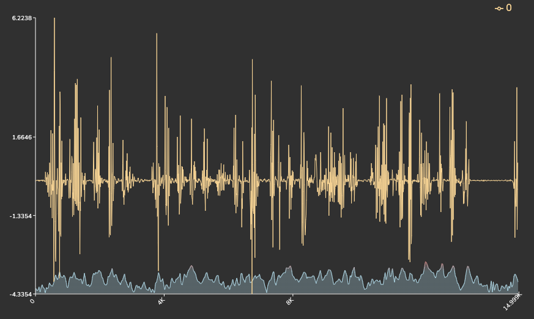
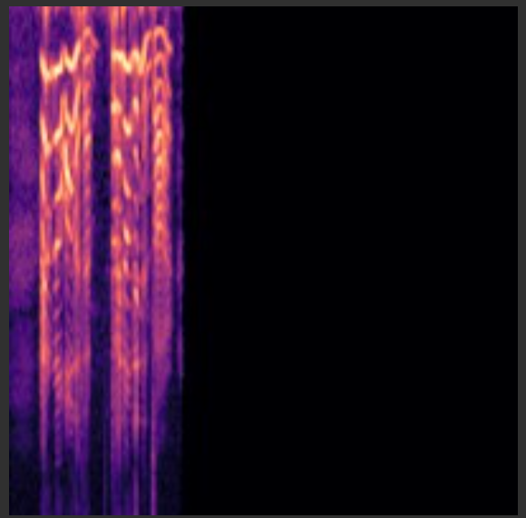
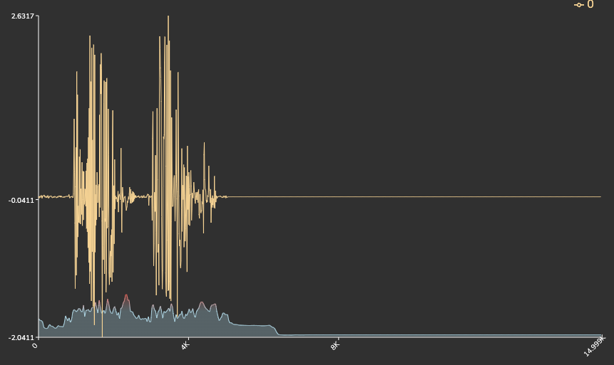
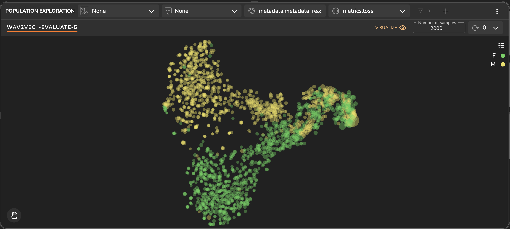
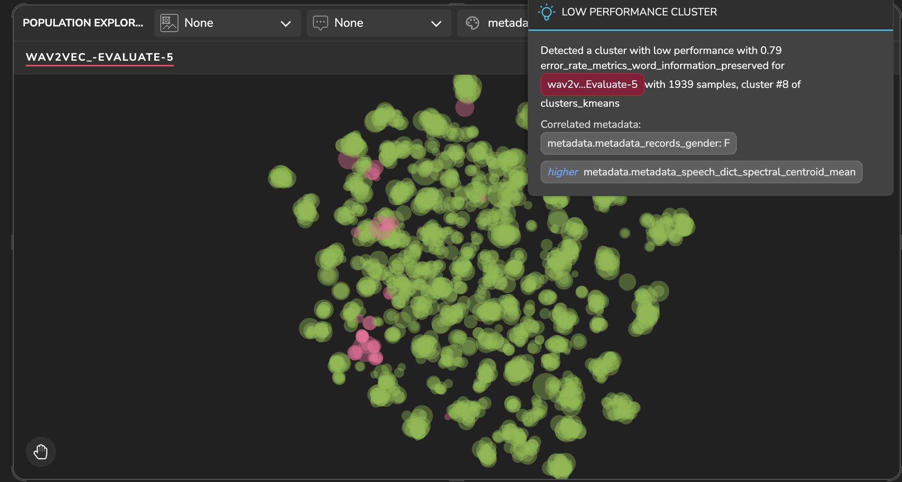
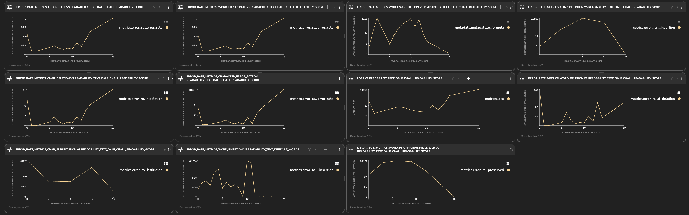

# LibriSpeech Dataset With Wav2vec



This project showcases a speech recognition task for predicting the text from an audio file. We utilize a 
[wav2vec](https://arxiv.org/abs/2006.11477) model trained on the librispeech-asr benchmark, implemented using Keras and 
Tensorflow.

Using Tensorleap we can easily debug and improve the model development process. 

### The Dataset

LibriSpeech comprises around 1000 hours of English speech recorded at a 16kHz sampling rate. This corpus, curated by 
Vassil Panayotov with support from Daniel Povey, is extracted from read audiobooks sourced from the LibriVox project. 
The data has undergone meticulous segmentation and alignment.

### Methods

evaluate a pretrained wav2vec model on [librosaspeech](https://www.openslr.org/12) dataset. The model was evaluated with a batch size of 1, on 
Connectionist temporal classification (CTC) loss.

### Latent Space Exploration

Initially, you'll notice that the latent space is organized in such a way that the samples with fewer words with mainly short records are 
positioned towards the right, while those with a higher word count and mainly longer record length are positioned towards the left.
When the model has better results on the longer records and texts. To demonstrate we color the samples based on the words count and based on the record time:

_Model's Latent Space colored by Word count_

_Model's Latent Space colored by record minutes length_

We visualize below an example of a sample with long speech duration in comparison to a 
sample with short record speech and text. 


<div style="display: flex;">
  
  
</div>

*Long speech sample*


<div style="display: flex;">
  
  
</div>

_Short speech sample_

Additionally, we observe that the latent space is almost perfectly divided based on the speaker's gender:
_Model's Latent Space colored by record minutes length_


### Weak Clusters Detection
Tensorleap's engine calculates and detects using unsupervised methods clusters that tend to have lower performance than the overall data distribution.
For instance, we can observe a low performance cluster detected in the platform that consist mainly Female samples with high `spectral centroid mean` (correspond to high pitch):

_Low Performance Cluster: female gender and high pitch_


### Dashboard

We have added several metrics to the model. Using Tensorleap we can easily build an analytics dashboard. In the screenshot 
below we can see a dashboard contain the dale chall readability score VS all metrics.
Dale chall readability score computes a readability score based on a formula that considers the use of difficult words 
in the text, higher results indicate on higher difficulty.

It can be seen that metrics like Word Error Rate, Character Error Rate, Word Information Lost, Character Deletions, 
Word Deletion and the CTC loss are increase as the dale chall score increases.
In contrast, of metrics like Character Insertions, Word Substitutions, Character Substitutions, Word Insertions and Word 
Information Preserved decrease as the dale chall score increases.

_Dale Chall Readability Score VS Metrics_


# Project Quick Start

## Tensorleap CLI Installation

#### Prerequisites

Before you begin, ensure that you have the following prerequisites installed:

- [Python](https://www.python.org/) (version 3.7 or higher)

- [Poetry](https://python-poetry.org/)

<br>

with `curl`:

```
curl -s https://raw.githubusercontent.com/tensorleap/leap-cli/master/install.sh | bash
```

with `wget`:

```
wget -q -O - https://raw.githubusercontent.com/tensorleap/leap-cli/master/install.sh | bash
```

- CLI repository: https://github.com/tensorleap/leap-cli

## Tensorleap CLI Usage

### Tensorleap Login

To login to Tensorealp:

```
leap auth login [api key] [api url].
```

- See how to generate a CLI token [here](https://docs.tensorleap.ai/platform/resources-management)

## Tensorleap Project Deployment

Navigate to the project directory.

To push your local project files (model + code files):
```
leap projects push <modelPath> [flags]
```
To deploy only the project's code files: 

```
leap code push
```

### Tensorleap files

Tensorleap files in the repository include `leap_binder.py` and `leap.yaml`. The files consist of the required configurations to make the code integrate with the Tensorleap engine:

leap.yaml

leap.yaml file is configured to a dataset in your Tensorleap environment and is synced to the dataset saved in the environment.

For any additional file being used we add its path under `include` parameter:

```
include:

 - leap_binder.py

    ...

```

leap_binder.py file

`leap_binder.py` configure all binding functions used to bind to Tensorleap engine. These are the functions used to evaluate and train the model, visualize the variables, and enrich the analysis with external metadata variables

## Testing

To test the system we can run `leap_test.py` file using poetry:

```
poetry run test
```

This file will execute several tests on leap_binder.py script to assert that the implemented binding functions: preprocess, encoders, metadata, etc, run smoothly.

For further explanation please refer to the [docs](https://docs.tensorleap.ai/)