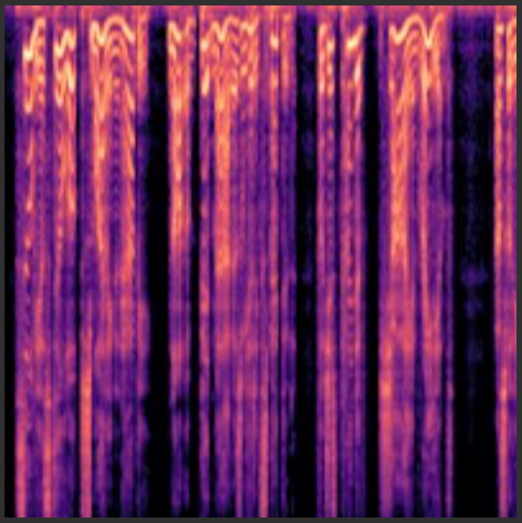
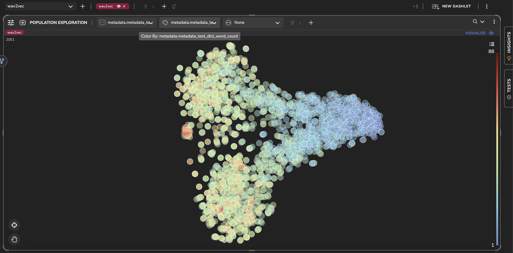
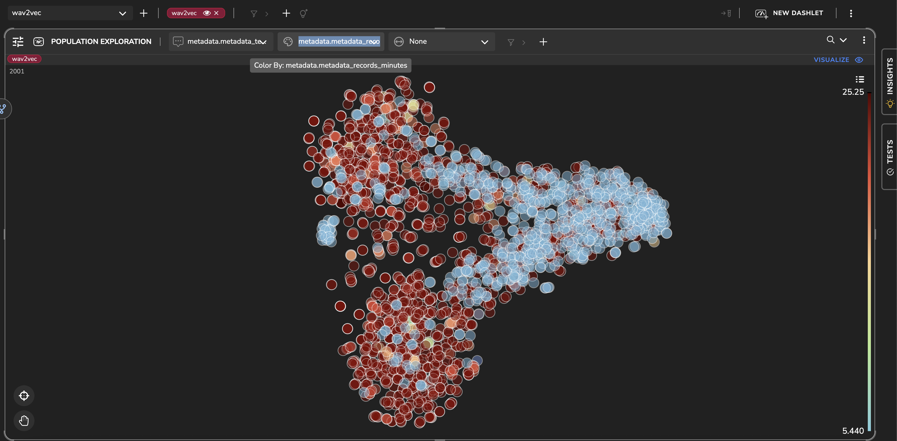
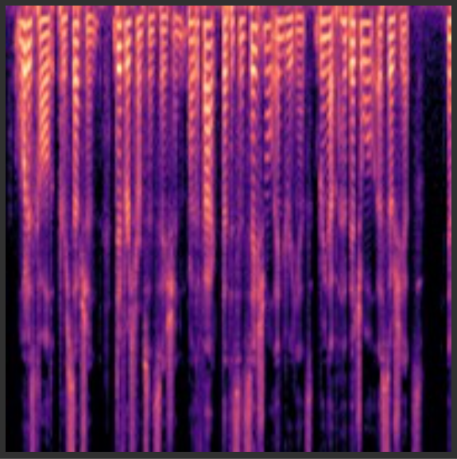
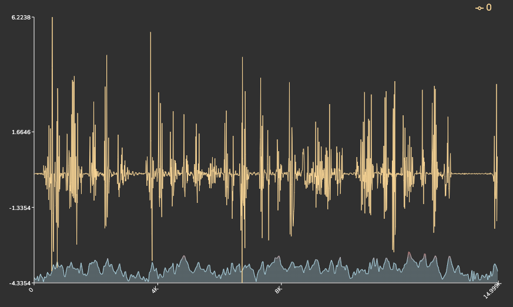
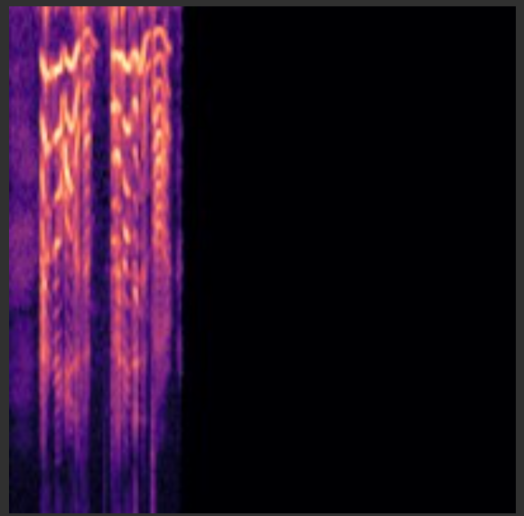
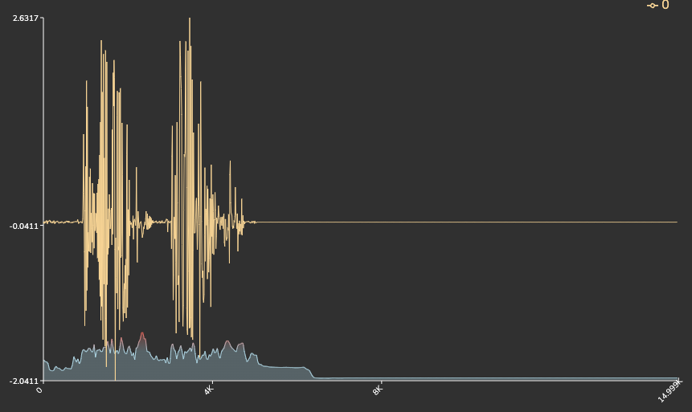
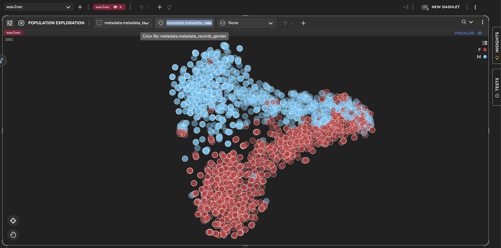
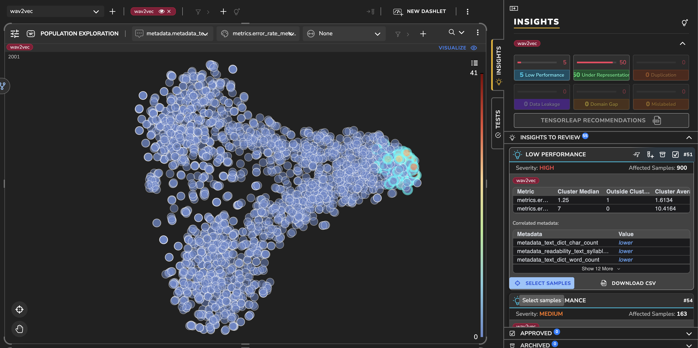
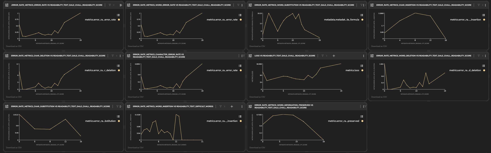

# Speech-to-Text with Wav2Vec 2.0 on LibriSpeech



This project demonstrates a speech recognition pipeline for transcribing audio files to text. We utilize a pretrained [Wav2Vec 2.0](https://arxiv.org/abs/2006.11477) model, fine-tuned on the LibriSpeech ASR benchmark, implemented using Keras and TensorFlow.

The project integrates with [Tensorleap](https://tensorleap.ai/) to enable advanced model debugging, performance analysis, and visualization of the model's internal representations.

### The Dataset

[LibriSpeech](https://www.openslr.org/12) is a corpus of approximately 1,000 hours of English speech recorded at 16kHz. Curated by Vassil Panayotov with support from Daniel Povey, the dataset is derived from read audiobooks in the LibriVox project. The data has been carefully segmented and aligned for speech recognition tasks.

### Methods

We evaluate a pretrained Wav2Vec 2.0 model on the LibriSpeech dataset using a batch size of 1, with Connectionist Temporal Classification (CTC) loss as the objective function.

### Latent Space Exploration

Initially, you'll notice that the latent space is organized in such a way that the samples with fewer words with mainly short records are 
positioned towards the right, while those with a higher word count and mainly longer record length are positioned towards the left.
To demonstrate, we color the samples based on word count and record time:

_Model's Latent Space colored by Word count_

_Model's Latent Space colored by record minutes length_

We visualize below an example of a sample with long speech duration in comparison to a 
sample with short record speech and text. 


<div style="display: flex;">
  
  
</div>

*Long record sample*


<div style="display: flex;">
  
  
</div>

_Short record sample_

Additionally, we observe that the latent space is almost perfectly divided based on the speaker's gender:
_Model's Latent Space colored by speaker's gender_


### Weak Clusters Detection
Tensorleap automatically identifies weak clusters using unsupervised analysis over the model’s internal representations. These clusters correspond to coherent subsets of the data that exhibit significantly lower performance compared to the overall distribution.

In the example above, Tensorleap detects a low-performance cluster composed of short text samples with simple vocabulary, inputs that are generally easy to read. Despite their apparent simplicity, this cluster shows degraded model performance. The detected insight reveals a high prevalence of unintended character insertions in the detected text, pointing to a systematic failure mode.

By surfacing such clusters, Tensorleap helps expose hidden patterns of model failure that are often missed by aggregate metrics.

_Low Performance Cluster: short and simple samples with high inserstion error_


### Dashboard

We have added several metrics to the model. Using Tensorleap we can easily build an analytics dashboard. In the screenshot 
below we can see a dashboard contain the dale chall readability score VS all metrics.
Dale chall readability score computes a readability score based on a formula that considers the use of difficult words 
in the text, higher results indicate on higher difficulty.

It can be seen that metrics like Word Error Rate, Character Error Rate, Word Information Lost, Character Deletions, 
Word Deletion and the CTC loss are increase as the dale chall score increases.
In contrast, of metrics like Character Insertions, Word Substitutions, Character Substitutions, Word Insertions and Word 
Information Preserved decrease as the dale chall score increases.

_Dale Chall Readability Score VS Metrics_


# Project Quick Start

## Tensorleap CLI Installation

#### Prerequisites

Before you begin, ensure that you have the following prerequisites installed:

- [Python](https://www.python.org/) (version 3.7 or higher)

- [Poetry](https://python-poetry.org/)

<br>

with `curl`:

```
curl -s https://raw.githubusercontent.com/tensorleap/leap-cli/master/install.sh | bash
```

with `wget`:

```
wget -q -O - https://raw.githubusercontent.com/tensorleap/leap-cli/master/install.sh | bash
```

- CLI repository: https://github.com/tensorleap/leap-cli

## Tensorleap CLI Usage

### Tensorleap Login

To login to Tensorealp:

```
leap auth login [api key] [api url].
```

- See how to generate a CLI token [here](https://docs.tensorleap.ai/platform/resources-management)

## Tensorleap Project Deployment

Navigate to the project directory.

To push your local project files (model + code files):
```
leap projects push <modelPath> [flags]
```
To deploy only the project's code files: 

```
leap code push
```

### Tensorleap files

Tensorleap files in the repository include `leap_binder.py` and `leap.yaml`. The files consist of the required configurations to make the code integrate with the Tensorleap engine:

leap.yaml

leap.yaml file is configured to a dataset in your Tensorleap environment and is synced to the dataset saved in the environment.

For any additional file being used we add its path under `include` parameter:

```
include:

 - leap_binder.py

    ...

```

leap_binder.py file

`leap_binder.py` configure all binding functions used to bind to Tensorleap engine. These are the functions used to evaluate and train the model, visualize the variables, and enrich the analysis with external metadata variables

## Testing

To test the system we can run `leap_test.py` file using poetry:

```
poetry run test
```

This file will execute several tests on leap_binder.py script to assert that the implemented binding functions: preprocess, encoders, metadata, etc, run smoothly.

For further explanation please refer to the [docs](https://docs.tensorleap.ai/)