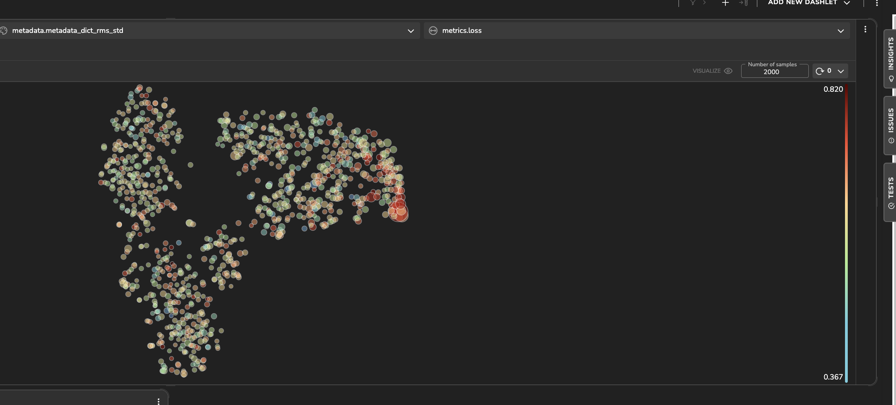
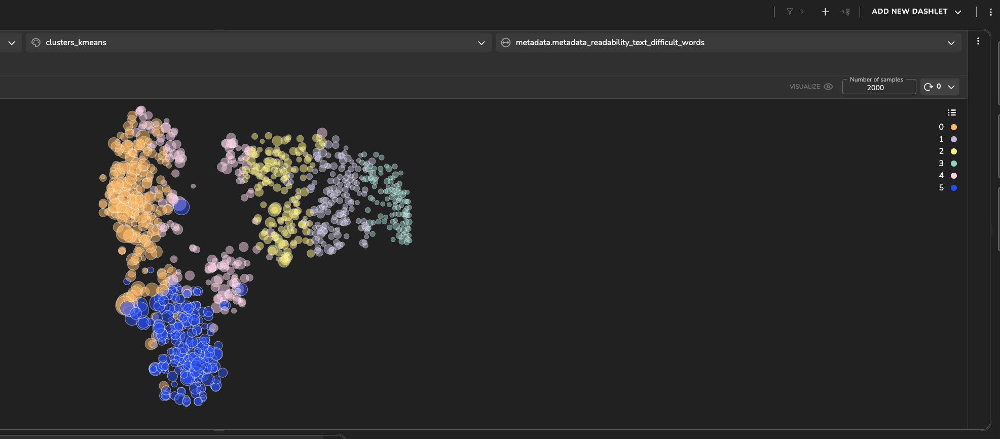

# LibriSpeech Dataset With Wav2vec


This project showcases a speech recognition task for predicting the text from an audio file. We utilize a 
[wav2vec](https://arxiv.org/abs/2006.11477) model trained on the librispeech-asr benchmark, implemented using Keras and 
Tensorflow.

Using Tensorleap we can easily debug and improve the model development process. 

### The Dataset

LibriSpeech comprises around 1000 hours of English speech recorded at a 16kHz sampling rate. This corpus, curated by 
Vassil Panayotov with support from Daniel Povey, is extracted from read audiobooks sourced from the LibriVox project. 
The data has undergone meticulous segmentation and alignment.

### Methods

evaluate a pretrained wav2vec model on [librosaspeech](https://www.openslr.org/12) dataset. The model was evaluated with a batch size of 1, on 
Connectionist temporal classification (CTC) loss.

### Latent Space Exploration

Initially, you'll notice that the latent space is organized in such a way that the samples with fewer words are 
positioned towards the right, while those with a higher word count are clustered towards the left.
The model has better results on longer texts.

_Model's Latent Space colored by Word count_

In the sample analysis below we can see an example of a sample with long speech, long text in comparison to a 
sample with short speech text. 


<div style="display: flex;">
  
  
</div>

*Long speech sample*


<div style="display: flex;">
  
  
</div>

_Short speech sample_

Spectral flatness is a measure that quantifies the tonal-to-noise ratio in a signal. A value closer to 0 indicates that 
the spectrum is more tonal, while a value closer to 1 suggests a flatter, more noise-like spectrum. Therefore, lower 
values of spectral flatness imply a more tonal or harmonically rich signal.

Despite not having large differences, a small group on the right side of the population exploration has minimal spectral 
flatness higher values (greener dots colors). 
If we compare it to the Character Error Rate (CER) metric, we notice that it tends to be higher when the spectral 
flatness min is higher (larger dots size).

_Model's Latent Space colored by minimum spectral flatness_

RMS stands for "Root Mean Square". RMS is a measurement of how much continuous power an audio signal produces. 
This means that RMS tells us how loud sound is on average over time, taking into account the dynamic range of the signal. 
It can be seen that samples with higher loss have higher rms std. 
A large standard deviation suggests greater variability in the amplitudes of the audio signal. 
In a speech signal, a larger standard deviation might indicate varying levels of emphasis or intensity in different 
parts of the speech.


_RMS std vs loss_

Using tensorleap, we noticed that samples with high Word Error Rate (WER) tend to be those with continuous speech.
It may be because a short pause may help each word to sound clearer.

<div style="display: flex;">
  
  
</div>

_Speech with pause (left), speech without pauses (right)_


By applying an unsupervised clustering algorithm (k-means) to the latent space of the model, the samples were segmented into five distinct clusters. 
The more we examine a cluster on the left side of the space, we find that its characterized with higher values of 
linsear write formula (calculates a readability score, the result is an estimate of the U.S. grade level needed to understand the text)
and number of difficult words in teh text.

<div style="display: flex;">
  
  
</div>

_Kmeans clusters_

#### Metrices

We have added several metrics to the model. Using Tensorleap we can easily bild an analytics dashboard. In the screenshot 
below we can see a dashboard contain the dale chall readability score VS all metrics.
Dale chall readability score computes a readability score based on a formula that considers the use of difficult words 
in the text, higher results indicate on higher difficulty.

It can be seen that metrics like Word Error Rate, Character Error Rate, Word Information Lost, Character Deletions, 
Word Deletion and the CTC loss are increase as the dale chall score increases.
In contrast, of metrics like Character Insertions, Word Substitutions, Character Substitutions, Word Insertions and Word 
Information Preserved decrease as the dale chall score increases.

_Dale Chall Readability Score VS Metrics_


# Project Quick Start

## Tensorleap CLI Installation

#### Prerequisites

Before you begin, ensure that you have the following prerequisites installed:

- [Python](https://www.python.org/) (version 3.7 or higher)

- [Poetry](https://python-poetry.org/)

<br>

with `curl`:

```
curl -s https://raw.githubusercontent.com/tensorleap/leap-cli/master/install.sh | bash
```

with `wget`:

```
wget -q -O - https://raw.githubusercontent.com/tensorleap/leap-cli/master/install.sh | bash
```

- CLI repository: https://github.com/tensorleap/leap-cli

## Tensorleap CLI Usage

### Tensorleap Login

To login to Tensorealp:

```
leap auth login [api key] [api url].
```

- See how to generate a CLI token [here](https://docs.tensorleap.ai/platform/resources-management)

## Tensorleap Project Deployment

Navigate to the project directory.

To push your local project files (model + code files):
```
leap projects push <modelPath> [flags]
```
To deploy only the project's code files: 

```
leap code push
```

### Tensorleap files

Tensorleap files in the repository include `leap_binder.py` and `leap.yaml`. The files consist of the required configurations to make the code integrate with the Tensorleap engine:

leap.yaml

leap.yaml file is configured to a dataset in your Tensorleap environment and is synced to the dataset saved in the environment.

For any additional file being used we add its path under `include` parameter:

```
include:

 - leap_binder.py

    ...

```

leap_binder.py file

`leap_binder.py` configure all binding functions used to bind to Tensorleap engine. These are the functions used to evaluate and train the model, visualize the variables, and enrich the analysis with external metadata variables

## Testing

To test the system we can run `leap_test.py` file using poetry:

```
poetry run test
```

This file will execute several tests on leap_binder.py script to assert that the implemented binding functions: preprocess, encoders, metadata, etc, run smoothly.

For further explanation please refer to the [docs](https://docs.tensorleap.ai/)